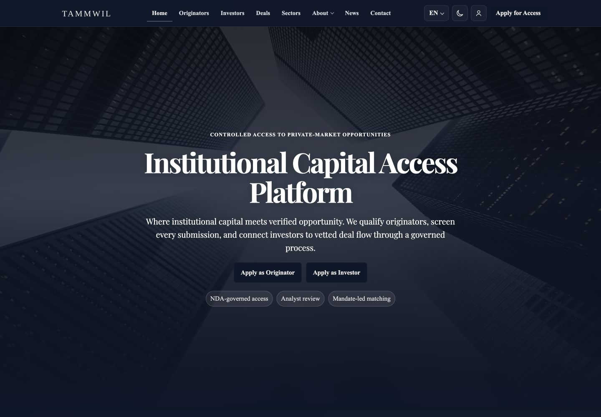
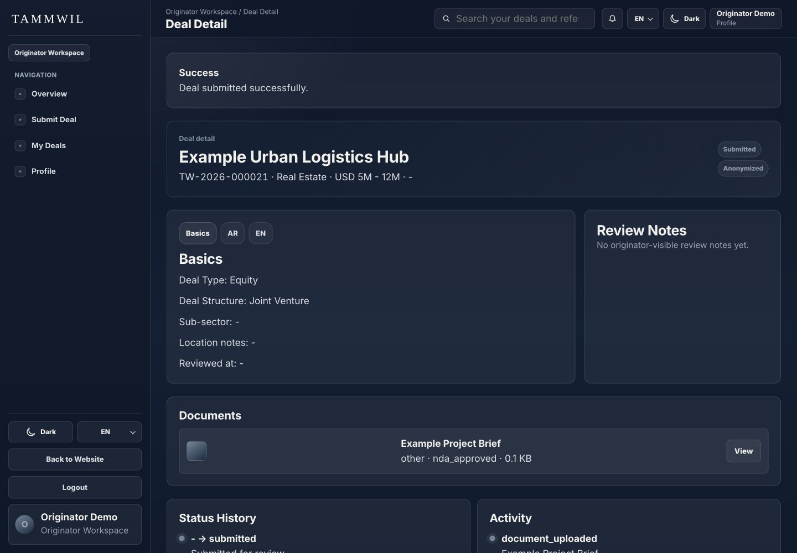
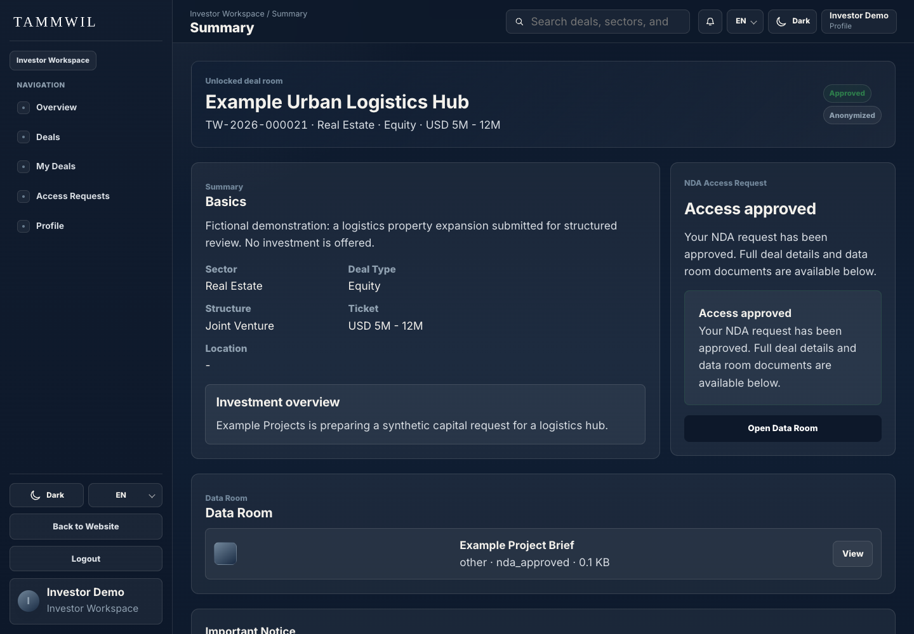
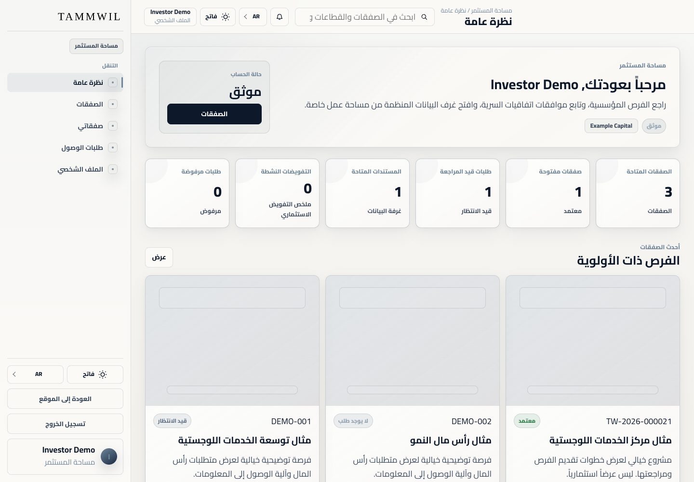
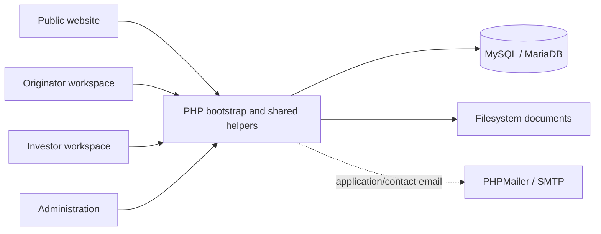

# Tammwil

**A bilingual capital-access platform connecting opportunity submission, administrative review and controlled investor access.**

Tammwil brings a public opportunity catalogue and three role-specific workspaces into one PHP application. Originators prepare deals and documents, administrators review submissions, and investors explore published opportunities before requesting access to further information. Developed as a client delivery by Ragıp Mullamusa / Ideabat.



[Public website](https://tammwil.com) · [Developer](https://ceo.ideabat.com) · [Ideabat](https://ideabat.com)

## What the platform supports

- **Opportunity preparation:** a six-step originator form for classification, ticket range, English/Arabic content, documents and submission. The backend writes the deal, localized records and status history in a transaction.
- **Review operations:** administrator queues, review notes, approval/publication states and activity records connect submissions to the public catalogue.
- **Investor access:** published opportunity filters, locked/approved deal views, access-request tracking and a document endpoint that checks the viewer’s role and deal access.
- **Platform administration:** user, application, contact, news, team, page, translation and public-setting management.
- **Bilingual presentation:** English/LTR and Arabic/RTL layouts, implemented light/dark themes and responsive web styling.

## Interfaces in this source tree

| Interface | Entry point | Intended users |
|---|---|---|
| Public website | index.php; ar/index.php | Visitors and applicants |
| Originator workspace | originator/index.php | Active originator accounts |
| Investor workspace | investor/index.php | Active investor accounts |
| Administration | admin/index.php | Active administrator accounts |

All four are interfaces of one web application. No separate iOS, Android or native desktop binary was found. Mobile-width browser presentation was tested on the public homepage; it is not a native-app release claim.

## A connected workflow

An originator submits an opportunity with bilingual content and supporting files. Its status appears in the review queue. Administrators can approve and publish it. Investors browse published summaries; deal-specific approved access controls additional document availability.



*The real submission screen after a fictional opportunity and CSV document were saved locally.*



*The investor view after a synthetic access request was approved. No legal agreement was executed for the demonstration.*



*Arabic/RTL content and the application’s own light theme. Gallery counters and records are synthetic.*

The [full screenshot map](screenshoots/SCREENSHOT_MAP.md) contains 17 inspected captures across all four surfaces, including administration, locked access and a mobile-width homepage.

## Architecture and technology

Route files load a shared bootstrap, session/authentication helpers and role-specific rendering/POST handlers. PHP renders HTML on the server; custom CSS and vanilla JavaScript handle themes, menus, tabs and the submission stepper. PDO prepared statements connect to a MySQL-compatible database. Translation tables and language helpers resolve labels and content. Uploaded documents are stored on disk and retrieved through document.php.



| Technology | Responsibility |
|---|---|
| PHP / PDO | Routing, rendering, form handling, authentication and data access |
| MySQL-compatible SQL | Users, roles, opportunities, translations, access decisions and history |
| CSS / vanilla JavaScript | Responsive layouts, LTR/RTL, themes and interactive forms |
| PHPMailer | SMTP integration for application/contact notifications; v6.12.0 pinned in composer.lock |
| Apache rewrite rules | Friendly deal/news URLs and directory restrictions |

```text
app/             Shared backend, role helpers, views and translations
admin/           Administrator PHP entry points
investor/        Investor PHP entry points
originator/      Originator PHP entry points
ar/              Arabic public routes
assets/          Styles, scripts, images and upload storage
config/          Mail configuration (local secrets must remain private)
database/        Supplied SQL export (not a public demo seed)
vendor/          Composer dependencies
*.php            Public routes and document endpoint
```

## Local setup and verification

Prerequisites: PHP with PDO MySQL, mbstring, fileinfo, GD and OpenSSL; a compatible MySQL/MariaDB database; writable local session/upload directories. No frontend compilation is required. PHP 8.2.4 and the already-installed dependencies were used for this review. If vendor is absent, `php composer.phar install` uses the lockfile; dependency installation was not needed or executed here.

Use an isolated development copy, a newly created disposable database and synthetic accounts. The supplied configuration/export is not a safe public seed. Configure the copy’s app/config.php for a loopback URL and that database; disable outbound SMTP before exercising forms.

```sh
# In the isolated, configured development copy:
php -d display_errors=0 -d sendmail_path=/usr/bin/false -S 127.0.0.1:8998 -t .
```

Direct PHP routes work with the built-in server. Use Apache and the supplied .htaccess for friendly slug URLs and its directory restrictions. Do not expose the development server publicly.

Executed checks: real browser login for all three roles, bilingual originator submission with file upload, administrative approval/local publication, locked and approved investor screens, role-denial and document-access HTTP checks, and syntax checks on 185 PHP files. This is focused local verification, not a full security or production certification.

Status limits: password-reset completion is explicitly deferred in code; live SMTP delivery and end-to-end NDA execution were not tested. Automated mandate matching is not claimed. Some Arabic labels use English fallbacks. Dates and measured business outcomes are not asserted.

## Attribution and licensing

Built by [Ragıp Mullamusa](https://www.linkedin.com/in/ragipmullamusa/), Founder & Software Engineer at [Ideabat](https://ideabat.com) — Product Engineering & Operational Software. Tammwil is a client delivery, not an Ideabat-owned product.

composer.json declares **proprietary** licensing. No project LICENSE file was found. Existing dependency licenses and component documentation remain unchanged; this README does not grant redistribution rights.
